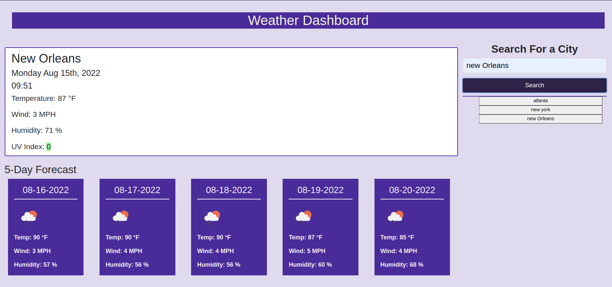

## weatherDashboard
No files were provide in the beginning, so the respective files need to be created. The purpose of this assignment is to input a city and have the broswer display the current weather and five-day forecast. To have weather dashboard update with the current time and date, Moment.js library was used.

## Website Screenshot
After creating html, css, and js files, this is what the website looks like.

## How Code Was Refractored
* Retreiving API data to view different weathers in different cities.
* Adding and calling functions to help perform a certain task.
* Using getItem and setItem save event in the local storage and displaying on the browser.
* Using objects, for loops, and if else statements to change the background color of the hour slots.
* Using bootstrap, helps design websites faster and easier (i.e., it takes care of flex box). 

## How to deploy the link application
* Click on this link for deployed application
* https://github.com/mstan19/weatherDashboardMelissaS
